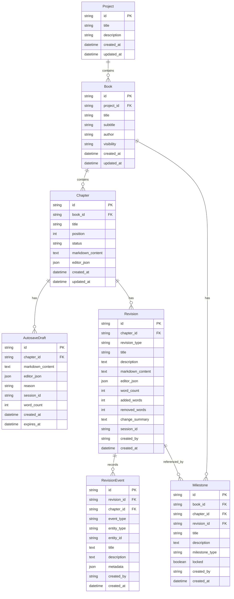

# easy-author-versioning-strategy.md

## 1. Ziel des Dokuments

Dieses Dokument beschreibt die Versionierungsstrategie für die **easy-author App**.

Die Versionierung soll Autoren vor Datenverlust schützen, Schreibstände nachvollziehbar machen und eine bewusste Wiederherstellung ermöglichen, ohne den Schreibfluss durch technische Entwicklerkonzepte wie Git-Commits, Branches oder Merge-Konflikte zu belasten.

Der zentrale Gedanke lautet:

> **Autosave schützt vor Verlust. Versionierung bewahrt Bedeutung.**

Autosave und Versionierung dürfen daher nicht gleichgesetzt werden.

---

## 2. Grundprinzipien

### 2.1 Autosave ist keine Autoren-Version

Autosave speichert fortlaufend technische Sicherheitsstände. Diese Stände sollen Datenverlust vermeiden, aber nicht als hunderte sichtbare Versionen in der Autorenoberfläche erscheinen.

Autosave beantwortet die Frage:

> „Wie verhindere ich, dass Text verloren geht?“

Versionierung beantwortet dagegen:

> „Zu welchem sinnvollen Schreib-, Denk- oder Entscheidungsstand möchte ich zurückkehren?“

---

### 2.2 Versionen brauchen Bedeutung

Eine echte Version entsteht nicht bei jeder Kleinigkeit, sondern bei einem fachlich oder workflowbezogen sinnvollen Zustand.

Typische Versionierungsanlässe:

- Ende einer Schreibsession
- bewusst gesetzter Meilenstein
- vor einem Review
- nach einem Review-Abschluss
- vor einem Export
- nach einem Import
- nach einer Wiederherstellung
- vor größeren Strukturänderungen
- nach größeren Kapitelverschiebungen

---

### 2.3 Git ist kein primäres Autorenwerkzeug

Git kann später als technischer Backup- oder Archivierungs-Layer sinnvoll sein, soll aber nicht die primäre Autoren-Versionierung darstellen.

Git denkt in Dateien und Commits. easy-author denkt in:

- Büchern
- Kapiteln
- Absätzen
- Schreibsessions
- Meilensteinen
- Kommentaren
- Review-Ständen
- Ankern
- Workflow-Boxen
- Clipboard-Elementen

Deshalb soll Git nicht als sichtbare Autoren-UX verwendet werden.

---

## 3. Vier-Schichten-Versionierung

easy-author verwendet eine vierstufige Versionierungslogik.

```text
Ebene 1: AutosaveDraft       technische Sicherheitskopien
Ebene 2: Revision            sinnvolle verdichtete Kapitelstände
Ebene 3: Milestone           bewusst gesetzte Autoren-Meilensteine
Ebene 4: RevisionEvent       erklärende Ereignisse innerhalb der Versionierung
```

---

## 4. AutosaveDraft

### 4.1 Zweck

`AutosaveDraft` speichert kurzfristige technische Sicherheitsstände eines Kapitels.

Diese Stände sind wichtig für:

- Schutz vor Browser-Absturz
- Schutz vor Netzwerkfehlern
- Schutz vor versehentlichem Tab-Schließen
- kurzfristige Wiederherstellung
- spätere Verdichtung zu sinnvollen Revisionen

### 4.2 UX-Regel

AutosaveDrafts erscheinen nicht standardmäßig in der normalen Versionstimeline.

Sie sind eine technische Sicherheitsreserve und werden nur sichtbar, wenn der Autor gezielt in eine Schreibsession hineinzoomt oder eine Notfall-Wiederherstellung benötigt.

### 4.3 Verdichtungsstrategie

Um eine Versionsflut zu vermeiden, werden Autosaves intelligent verdichtet.

Empfohlene Verdichtung:

```text
letzte 10 Minuten: fein granular
letzte 2 Stunden: alle 5 Minuten
letzte 24 Stunden: alle 30 Minuten
älter als 24 Stunden: nur noch sessionbezogene Verdichtungen
```

Manuelle Meilensteine und wichtige Revisionen werden niemals automatisch gelöscht.

---

## 5. Revision

### 5.1 Zweck

`Revision` ist ein sinnvoller, wiederherstellbarer Kapitelstand.

Eine Revision ist für Autoren sichtbar und steht für einen konkreten Zustand, zum Beispiel:

- Schreibsession abgeschlossen
- vor Review
- nach Review
- vor Export
- nach Import
- nach Wiederherstellung

### 5.2 Schreibsession als wichtigste automatische Revision

Wenn ein Autor zwei Stunden an einem Kapitel arbeitet, entstehen nicht hunderte Versionen, sondern eine zusammengefasste Schreibsession.

Beispiel:

```text
14:00 Kapitel geöffnet
14:01 erste Änderung
14:01–16:05 Autosaves laufen technisch im Hintergrund
16:05 Session endet
16:05 Revision entsteht: „Schreibsession 14:00–16:05“
```

Metadaten der Revision:

```text
+ 1.240 Wörter
- 310 Wörter
7 Absätze geändert
3 Kommentare erledigt
2 Anker gesetzt
1 Clipboard-Item eingefügt
```

### 5.3 Revisionstypen

Empfohlene Werte für `revision_type`:

```text
session
manual
before_review
after_review
before_export
after_import
before_import
restore
structure_change
system
```

---

## 6. Milestone

### 6.1 Zweck

`Milestone` ist ein bewusst gesetzter, dauerhaft sichtbarer Autorenstand.

Ein Milestone ist nicht bloß technisch, sondern fachlich bedeutsam.

Typische Meilensteine:

```text
Rohfassung abgeschlossen
Vor Lektorat
Nach Lektorat
Vor KI-Review
Nach KI-Review
Vor Export
Finale Fassung
Verlagsfassung
Leseprobe
```

### 6.2 UX-Regel

Milestones werden niemals automatisch gelöscht oder verdichtet.

Sie können optional gesperrt werden (`locked = true`), damit sie nicht versehentlich verändert oder entfernt werden.

---

## 7. RevisionEvent

### 7.1 Zweck

`RevisionEvent` beschreibt, was innerhalb oder zwischen Versionen geschehen ist.

Es ist kein vollständiger Textstand, sondern ein Ereignisprotokoll.

Beispiele:

- Kapitel gespeichert
- Anchor erstellt
- Kommentar erledigt
- Review gestartet
- Review abgeschlossen
- KI-Vorschlag angenommen
- KI-Vorschlag abgelehnt
- Clipboard-Slot eingefügt
- Kapitelstatus geändert
- Export erzeugt

### 7.2 Nutzen

RevisionEvents helfen dabei, Versionen für Autoren verständlicher zu machen.

Statt nur technischer Diffs kann easy-author erklären:

> „In dieser Session wurden zwei offene Review-Kommentare erledigt und eine Mutmach-Übung ergänzt.“

---

## 8. Versionierungs-UX

### 8.1 Timeline statt Git-Historie

Die Versionierung soll als Autoren-Timeline dargestellt werden.

Standardansicht:

```text
Meilensteine
Schreibsessions
Reviews
Exporte
Wiederherstellungen
```

Nicht sichtbar in der Standardansicht:

```text
jeder einzelne Autosave
technische Zwischenstände
interne Sync-Ereignisse
```

---

### 8.2 Zoom-Stufen

Die Timeline unterstützt Zoom-Stufen:

```text
Ebene 1: Meilensteine
Ebene 2: Schreibsessions
Ebene 3: Zwischenstände innerhalb einer Session
Ebene 4: technische Autosaves für Notfälle
```

Der Autor sieht standardmäßig Ebene 1 und 2.

Ebene 3 und 4 werden nur bei Bedarf geöffnet.

---

### 8.3 Slider-Wiederherstellung

Eine Slider-Bar kann verwendet werden, um durch historische Kapitelstände zu navigieren.

Der Slider soll nicht nur Uhrzeiten zeigen, sondern bedeutsame Punkte:

```text
Schreibsession
Meilenstein
Review
Export
Import
Wiederherstellung
```

Beim Bewegen des Sliders sieht der Autor eine Vorschau des jeweiligen Kapitelstands.

---

## 9. Wiederherstellungslogik

Wiederherstellung darf nicht nur „alles oder nichts“ bedeuten.

Mögliche Aktionen:

```text
ganzes Kapitel wiederherstellen
einzelnen Absatz wiederherstellen
markierte Passage übernehmen
alte Passage in Clipboard-Box legen
alte Passage als Notiz speichern
alte Version neben aktueller Version anzeigen
alte Version mit aktueller Version vergleichen
```

Diese Logik ist für Autoren deutlich wertvoller als ein technisches Git-Revert.

---

## 10. Textvergleich

### 10.1 Autorenfreundlicher Diff

Der Textvergleich soll nicht als technische Diff-Wand erscheinen.

Stattdessen sollte easy-author Veränderungen verständlich beschreiben:

```text
Absatz ergänzt
Absatz gekürzt
Formulierung geändert
Text verschoben
Kommentar erledigt
Anchor erstellt
Review-Vorschlag angenommen
```

### 10.2 Semantischer Vergleich als spätere Erweiterung

Später kann die Review-API genutzt werden, um semantische Veränderungen zu beschreiben:

```text
Der Ton wurde sachlicher.
Der Abschnitt wurde stärker verdichtet.
Das Leitmotiv „Vertrauen“ wurde abgeschwächt.
Die Übung ist jetzt klarer formuliert.
```

---

## 11. Datenmodell

### 11.1 Mermaid ER-Diagramm



---

### 11.2 Tabellenbeschreibung

#### AutosaveDraft

Kurzlebiger Sicherheitsstand eines Kapitels.

Empfohlene Felder:

```text
id
chapter_id
markdown_content
editor_json
reason
session_id
word_count
created_at
expires_at
```

`reason` kann zum Beispiel sein:

```text
idle_autosave
interval_autosave
before_navigation
before_close
manual_safety_save
```

---

#### Revision

Sinnvoller, sichtbarer Kapitelstand.

Empfohlene Felder:

```text
id
chapter_id
revision_type
title
description
markdown_content
editor_json
word_count
added_words
removed_words
change_summary
session_id
created_by
created_at
```

---

#### Milestone

Bewusst gesetzter Meilenstein.

Empfohlene Felder:

```text
id
book_id
chapter_id optional
revision_id
title
description
milestone_type
locked
created_by
created_at
```

`milestone_type` kann zum Beispiel sein:

```text
rough_draft
before_review
after_review
before_export
final
publisher_submission
reading_sample
custom
```

---

#### RevisionEvent

Ereignis innerhalb der Versionierung.

Empfohlene Felder:

```text
id
revision_id
chapter_id
event_type
entity_type
entity_id
title
description
metadata
created_by
created_at
```

`event_type` kann zum Beispiel sein:

```text
chapter_saved
anchor_created
comment_resolved
review_started
review_completed
ai_suggestion_accepted
ai_suggestion_rejected
clipboard_inserted
status_changed
export_created
restore_performed
```

`entity_type` kann zum Beispiel sein:

```text
chapter
anchor
comment
review_item
clipboard_item
workflow_box
export
```

---

## 12. Zusammenspiel mit Kommentaren und Review-API

Die Versionierung ist Grundlage für spätere Review- und KI-Funktionen.

Vor einem Review sollte automatisch eine Revision entstehen:

```text
revision_type = before_review
```

Nach Abschluss eines Reviews entsteht eine weitere Revision:

```text
revision_type = after_review
```

Wichtige Review-Entscheidungen werden zusätzlich als RevisionEvents protokolliert:

```text
Review-Vorschlag angenommen
Review-Vorschlag abgelehnt
Review-Kommentar als Notiz gespeichert
Review-Kommentar erledigt
```

Damit bleibt nachvollziehbar, welche Änderungen wirklich durch den Autor entschieden wurden.

---

## 13. Zusammenspiel mit Exporten

Vor jedem bedeutenden Export sollte easy-author automatisch eine Revision erstellen:

```text
revision_type = before_export
```

Optional kann der Autor diesen Stand als Milestone markieren:

```text
„PDF-Export für Testleser“
„EPUB-Fassung 1.0“
„Verlagsfassung“
```

---

## 14. Empfohlene API-Routen

Für einen späteren Versionierungs-Spike werden folgende API-Routen empfohlen:

```text
GET    /api/chapters/:chapterId/autosaves
POST   /api/chapters/:chapterId/autosaves
DELETE /api/autosaves/:id

GET    /api/chapters/:chapterId/revisions
POST   /api/chapters/:chapterId/revisions
GET    /api/revisions/:id
POST   /api/revisions/:id/restore

GET    /api/books/:bookId/milestones
POST   /api/books/:bookId/milestones
PUT    /api/milestones/:id
DELETE /api/milestones/:id

GET    /api/revisions/:revisionId/events
POST   /api/revisions/:revisionId/events
```

---

## 15. MVP-Empfehlung

Für den ersten Versionierungs-Spike reicht:

```text
AutosaveDraft technisch speichern
Revision manuell erzeugen
Revision automatisch bei Session-Ende erzeugen
Milestone aus Revision erstellen
Revision-Liste anzeigen
alte Revision anzeigen
komplettes Kapitel aus Revision wiederherstellen
```

Noch nicht im ersten Spike erforderlich:

```text
semantischer Diff
abschnittsweise Wiederherstellung
Slider mit Zoom-Stufen
KI-Zusammenfassung von Änderungen
Git-Backup-Layer
```

---

## 16. Vermeidungsstrategien

### Herausforderung: Zu viele technische Versionen

Strategie:

```text
Autosaves nicht als Versionen anzeigen.
Autosaves verdichten.
Nur Revisionen und Milestones prominent anzeigen.
```

### Herausforderung: Autor verliert Orientierung

Strategie:

```text
Versionen mit verständlichen Titeln und Zusammenfassungen versehen.
Timeline nach Meilensteinen, Sessions, Reviews und Exporten gruppieren.
```

### Herausforderung: Wiederherstellung überschreibt gute neue Arbeit

Strategie:

```text
Vor jeder Wiederherstellung neue Revision erstellen.
Wiederherstellung zunächst als Vorschau anzeigen.
Alte Passage optional nur in Clipboard übernehmen.
```

### Herausforderung: Git-Denke dominiert Autorenfluss

Strategie:

```text
Git nicht als sichtbare Autorenoberfläche verwenden.
Autorenlogik über Timeline, Sessions und Milestones abbilden.
```

---

## 17. Entscheidungssatz für das Projekt

> easy-author verwendet Autosave als technische Sicherheitsfunktion, aber nicht als sichtbare Autoren-Versionierung. Bedeutende Textstände werden über Schreibsessions, manuelle Meilensteine, Review-Stände und Export-Stände verdichtet. Git kann später optional als unsichtbarer Backup-Layer dienen, ist jedoch nicht die primäre Versionierungslogik der App.

---

## 18. Nächste technische Schritte

1. Datenmodell in Backend-Migrationen überführen.
2. AutosaveDraft technisch einführen.
3. Revision-Erzeugung bei manueller Aktion ermöglichen.
4. Einfache Session-Erkennung ergänzen.
5. Milestone aus Revision erstellen.
6. Revision-Timeline im Frontend anzeigen.
7. Wiederherstellung kompletter Kapitel ermöglichen.
8. Danach abschnittsweise Wiederherstellung und Timeline-Slider planen.

