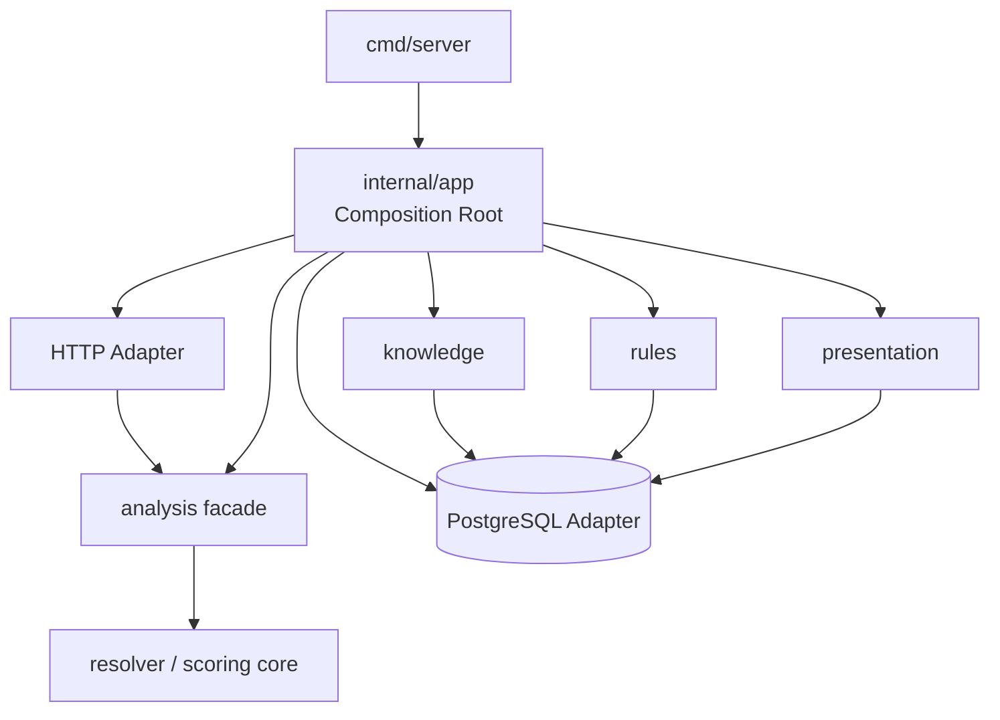

# Sprach-A-Lyzer – Modular Monolith v0.1

**Status:** APPROVED  
**Version:** 0.1  
**Stand:** 24. August 2026  
**Owner:** Engineering

## Entscheidung

Der Sprach-A-Lyzer wird als modularer Monolith entwickelt: ein Go-Modul, ein
API-Prozess und eine PostgreSQL-Datenbank, aber explizite fachliche Grenzen.
Die Module kommunizieren über kleine Go-Schnittstellen und werden nur in der
Composition Root verbunden.

## Fachmodule

### `analysis`

Öffentliche Fassade für Analyse-Requests und -Ergebnisse. Resolver, Engine und
Domain-Typen sind Implementierungsdetails hinter dieser Fassade. HTTP, CLI und
Golden Harness dürfen nicht direkt auf diese Interna zugreifen.

### `knowledge`

Besitzt den kanonischen linguistischen Wissensbestand: Dimensionen, Lexeme,
Senses und Phrases. Das Modul stellt zunächst einen versionierbaren Snapshot
über einen Repository-Port bereit.

### `rules`

Besitzt publizierte Rule Sets und Regeldefinitionen. Persistierte Conditions
und Actions werden als JSON-Verträge gelesen. Die bestehende Vertical-Slice-
Engine bleibt deterministisch; die vollständige Ausführung geladener Regeln
ist ein nachfolgender Ausbau.

### `presentation`

Besitzt Profile, Labels und Fallbacks. Unbekannte Schlüssel werden niemals als
kanonischer Rohschlüssel ausgegeben. Damit bleibt insbesondere das Corporate
Bundle von privaten Begriffen isoliert.

## Composition Root

`internal/app` ist der einzige Ort, der alle Fachmodule zusammensetzt. Der
Server erhält daraus die Analyse-Fassade und die technische Readiness. Neue
Module werden hier verdrahtet, nicht über globale Variablen oder versteckte
Service-Locator.

## Technische Adapter

- `internal/httpapp`: REST-Ein-/Ausgabe
- `internal/db`: PostgreSQL-Verbindung, Migration und Readiness
- `internal/config`: Umgebungskonfiguration
- `internal/seed`: idempotente Initialdaten
- `cmd/*`: ausführbare Composition-/Betriebseinstiege

Diese Adapter enthalten keine fachliche Scoring-Entscheidung.

## Abhängigkeitsregeln

1. Fachmodule importieren keine anderen Fachmodule.
2. Die Composition Root darf alle Module kennen.
3. Transportadapter sprechen mit Modul-Fassaden, nicht mit Engine-Interna.
4. PostgreSQL bleibt ein Adapter; fachliche Services hängen an Repository-Ports.
5. Keine globalen veränderlichen Singletons.
6. Ein Modulwechsel darf keinen Netzwerkaufruf innerhalb des Monolithen erzeugen.
7. Der Architekturtest ist Teil des Release-Gates.

## Bewusste Übergangsstruktur

`internal/engine` und `internal/domain` liegen physisch noch als eigenständige
Pakete vor, gehören aber ausschließlich zum Analysemodul. Der Architekturtest
verbietet anderen Modulen und Adaptern den direkten Import. Dadurch kann ihre
interne Ordnerstruktur später ohne Änderung der öffentlichen Modulgrenze
weiter zerlegt werden.

## Nicht-Ziele

- keine Microservices
- kein Event Bus für lokale Funktionsaufrufe
- keine getrennten Datenbanken pro Modul
- keine zyklischen Modulabhängigkeiten
- keine abstrakten Interfaces ohne fachlichen Port
